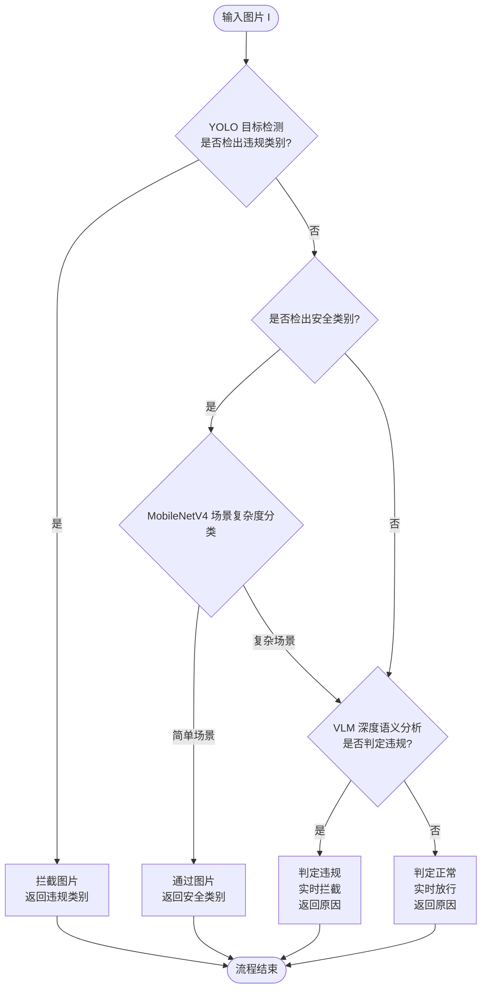

# 面向校园网高并发场景的CNN-VLM级联图像审核系统设计与轻量化研究


# keywords:vision-language models; content moderation; cascade architecture; lightweight deployment; high concurrency

# 第1章 绪论

## 1.1 研究背景
### 1.1.1 校园网络图像内容安全面临的新挑战
### 1.1.2 现有图像审核技术的局限性
### 1.1.3 级联融合架构的研究趋势与现实需求

## 1.2 研究目的
### 1.2.1 突破单一CNN模型在隐喻与复杂语义场景下的识别瓶颈
### 1.2.2 设计双重CNN前置拦截策略，保障VLM专注于复杂语义分析
### 1.2.3 验证“端边云”协同架构在低成本硬件上的部署可行性与实时性

## 1.3 国内外研究现状
### 1.3.1 轻量级目标检测与图像分类模型的研究进展
### 1.3.2 视觉语言模型（VLM）在图像安全领域的应用现状
### 1.3.3 多模型级联与协同推理架构研究综述
### 1.3.4 现有研究的不足与本文研究定位

# 第2章 相关技术与理论基础

## 2.1 基于CNN的目标检测与轻量化分类技术
### 2.1.1 卷积神经网络与目标检测基础理论

卷积神经网络（Convolutional Neural Network, CNN）是一类通过局部感受野、权值共享与多层特征提取机制实现高效视觉建模的深度学习模型。其核心结构包括卷积层、池化层、非线性激活函数以及全连接层。CNN能够逐层提取图像的低层纹理特征、中层结构特征以及高层语义特征，在图像分类、目标检测与语义分割任务中具有广泛应用。

在目标检测领域，主流算法可分为两阶段检测算法（如R-CNN系列）与单阶段检测算法（如YOLO系列）。两阶段算法检测精度较高但推理速度较慢，而单阶段检测算法通过回归方式直接预测目标类别与边界框位置，具有更高的实时性优势，更适用于高并发图像审核场景。

### 2.1.2 YOLO系列算法及其在内容审核中的应用

YOLO（You Only Look Once）是一种典型的单阶段目标检测算法，通过将图像划分为网格并同时预测类别概率与边界框，实现端到端检测。其主要优势包括：

- 推理速度快（毫秒级响应）
- 结构轻量，适合边缘部署
- 支持多类别目标检测

在图像内容审核场景中，YOLO模型可用于识别预定义的违规类别（如违禁物品、明显色情目标等）或明确安全类别，从而实现快速初筛。通过置信度阈值机制，可在保证高召回率的同时控制误报率，为后续语义分析模块提供有效分流依据。

### 2.1.3 轻量化卷积网络 MobileNet 及其场景分类机制

MobileNet 是一种面向移动端和嵌入式设备设计的轻量级卷积神经网络，其核心创新在于引入**深度可分离卷积（Depthwise Separable Convolution）**结构，将传统卷积操作拆分为：

1. 深度卷积（Depthwise Convolution）
2. 逐点卷积（Pointwise Convolution）

该结构显著降低了参数量与计算量，在保持较高精度的同时提升推理效率。

MobileNetV3 在前代版本基础上进一步优化，引入：

- 神经架构搜索（NAS）
- SE注意力机制（Squeeze-and-Excitation）
- h-swish激活函数

使其在性能与效率之间取得更优平衡。

在本系统中，MobileNetV3 被用于**场景复杂度分类任务**，其作用并非直接判断违规与否，而是评估图像语义结构是否复杂。通过训练模型区分“简单场景”与“复杂语义场景”，可以在级联架构中实现以下功能：

- 对仅包含单一安全目标的简单场景进行快速放行；
- 对存在多目标、遮挡、文字叠加或潜在隐喻的复杂场景进行标记；
- 为后续视觉语言模型（VLM）提供精细化分流依据。

这种“目标检测 + 场景复杂度评估”的双层CNN机制，有效降低了复杂语义误放风险，同时减少了进入大模型分析阶段的样本比例。

## 2.2 基于视觉语言模型的图像语义理解技术

### 2.2.1 视觉语言模型（VLM）的语义理解机制

视觉语言模型（Vision-Language Model, VLM）是一类融合视觉编码器与语言模型的多模态模型，能够实现图像与文本之间的语义对齐与跨模态推理。其基本结构通常包括：

- 视觉编码器（如ViT或CNN Backbone）
- 跨模态对齐模块
- 大规模语言模型（LLM）

VLM通过对图像特征与文本语义进行联合建模，可以完成图像描述生成、视觉问答、语义推理等任务。与传统CNN不同，VLM不仅关注视觉特征，还能够结合上下文知识进行逻辑推断，因此在识别隐喻色情、符号化表达、政治隐喻等复杂违规场景时具有明显优势。


### 2.2.2 Qwen3-VL 的高语义理解能力

Qwen3-VL 是一种具备强大跨模态理解能力的视觉语言模型，支持图像输入与文本推理输出。其主要特点包括：

- 高质量图像语义描述能力；
- 对复杂场景和抽象概念的推理能力；
- 支持多轮语义交互与细粒度判断。

在本系统中，Qwen3-VL 被部署为深度语义分析模块，通过对疑似样本进行“图像理解 + 逻辑判断”，输出违规或正常的语义判定结果。结合提示词工程（Prompt Engineering）与本地推理框架，可实现对复杂违规内容的高精度识别，从而弥补传统CNN在抽象语义理解方面的不足。

## 2.3 多模型级联与协同推理理论基础

多模型级联（Cascade Architecture）是一种通过分层过滤策略提高系统整体效率的架构设计方法。其核心思想为：

- 前级模型负责高频、低成本筛查；
- 后级模型处理低频、高复杂度样本；
- 通过阈值控制实现动态分流。

在图像审核场景中，采用“轻量级CNN + VLM”级联架构可以有效平衡：

- 准确率（Accuracy）
- 实时性（Latency）
- 计算资源消耗（Resource Consumption）

# 第3章 系统架构设计与算法实现

## 3.1 系统设计目标与总体架构
### 3.1.1 设计目标:平衡准确率、实时性与轻量级部署
### 3.1.2 总体架构:三级级联过滤

## 3.2 系统层级划分
### 3.2.1 数据接入与预处理层
### 3.2.2 CNN高速检测层
- 高速检测层：YOLOv10（目标检测） + MobileNetV3（场景分类）。
### 3.2.3 CNN场景复杂度分类层
### 3.2.4 VLM语义分析层
- 语义分析层：Qwen3-VL（语义分析，由Ollama托管）。
### 3.2.5 交互界面层

## 3.3 核心模块算法设计
### 3.3.1 图像预处理算法
### 3.3.2 YOLO检测算法设计
### 3.3.3 MobileNetV3场景分类算法
### 3.3.4 Qwen3-VL语义分析算法
### 3.3.5 级联决策算法

## 3.4 级联处理流程与时序分析

# 第4章 系统实现方案与轻量化可行性分析

## 4.1 实验环境

## 4.2 数据集构建与标注规范
### 4.2.1 训练集构建
### 4.2.2 测试集划分
### 4.2.3 标注标准

## 4.3 性能评估指标
- 准确率（Accuracy）
- 召回率（Recall）
- F1-score
- 延迟（Latency）
- 吞吐量（QPS）
- 显存占用
  
## 4.4 实验结果与对比分析
### 4.4.1 不同量化精度下显存对比
### 4.4.2 推理延迟对比
### 4.4.3 单模型 vs 级联模型性能对比
### 4.4.4 高并发场景压力测试

## 4.5 边缘部署可行性分析

# 第5章 总结与展望
## 5.1 全文总结
## 5.2 主要创新点
## 5.3 存在的不足
数据集为网上查找，
## 5.4 未来工作展望

# 参考文献

```MERMAID
sequenceDiagram
    participant UI as UI界面
    participant Pre as 图像预处理
    participant YOLO as YOLO检测
    participant MobileNet as MobileNet分类
    participant Qwen as Qwen语义分析

    UI->>Pre: 上传图片 I
    Pre->>YOLO: 预处理后图像

    YOLO-->>UI: 返回检测结果(类别列表)

    alt 检出违规类别
        UI-->>UI: 拦截图片并<br/>返回违规类别
    else 未检出违规类别
        alt 检出安全类别
            UI->>MobileNet: 场景复杂度分类
            MobileNet-->>UI: 返回 场景类型

            alt 简单场景
                UI-->>UI: 通过图片并<br/>返回安全类别
            else 复杂场景
                UI->>Qwen: 进行深度语义分析
                Qwen-->>UI: 返回语义判定结果

                alt 判定违规
                    UI-->>UI: 实时拦截并<br/>返回违规原因
                else 判定正常
                    UI-->>UI: 实时放行并<br/>返回正常原因
                end
            end
        else 未检出任何目标
            UI->>Qwen: 进行深度语义分析
            Qwen-->>UI: 返回语义判定结果

            alt 判定违规
                UI-->>UI: 实时拦截并<br/>返回违规原因
            else 判定正常
                UI-->>UI: 实时放行并<br/>返回正常原因
            end
        end
    end
```

